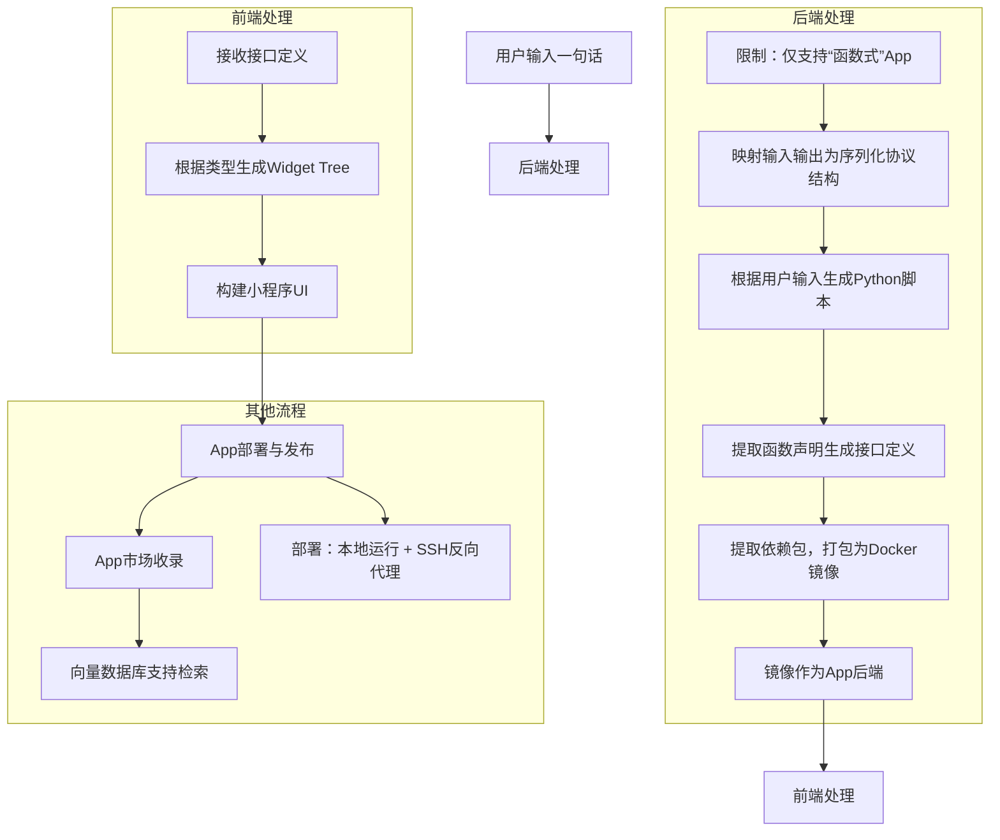

# Flow Chart

```mermaid
flowchart TD
    A[用户输入一句话] --> B[后端处理]
    
    subgraph 后端处理
        B1[限制：仅支持“函数式”App]
        B2[映射输入输出为序列化协议结构]
        B3[根据用户输入生成Python脚本]
        B4[提取函数声明生成接口定义]
        B5[提取依赖包，打包为Docker镜像]
        B6[镜像作为App后端]
        B1 --> B2 --> B3 --> B4 --> B5 --> B6
    end

    B6 --> C[前端处理]

    subgraph 前端处理
        C1[接收接口定义]
        C2[根据类型生成Widget Tree]
        C3[构建小程序UI]
        C1 --> C2 --> C3
    end

    C3 --> D[App部署与发布]

    subgraph 其他流程
        D1[App市场收录]
        D2[向量数据库支持检索]
        D3[部署：本地运行 + SSH反向代理]
        D --> D1 --> D2
        D --> D3
    end

```